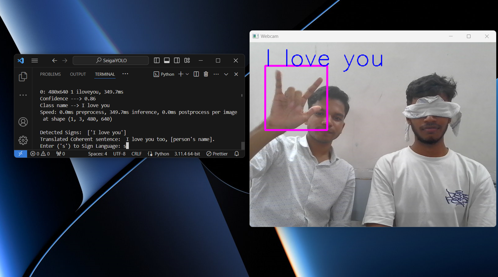
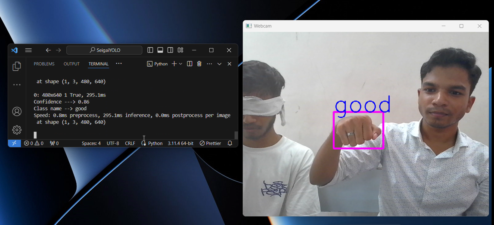
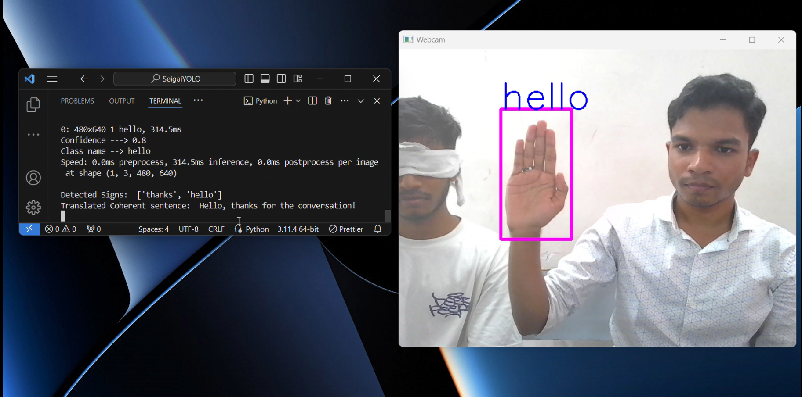

# Sign Language Detection and Translation using Python & Machine Learning (Ultralytics YOLOv8, OpenCV, Pyttsx3)

This is a sign language detection and translation model built using 
[ultralytics](https://github.com/ultralytics/ultralytics)
& [OpenCV](https://github.com/opencv/opencv)

Our pre-trained model trained on custom dataset detects sign language for the 9 following labels:
<ul>
    <li>Hello</li>
    <li>I Love You</li>
    <li>Yes</li>
    <li>No</li>
    <li>Thanks</li>
    <li>Please</li>
    <li>How</li>
    <li>Name</li>
    <li>You</li>
</ul>

Based on the limited vocabulary detected, the app can construct meaningful sentences and play and audio 🔊 of the sentences constructed to the user, thereby giving voice to people with determination 💪🏻 

## A Fun Backstory
We were complete noobs at the time of building the project. When we were looking for resources to build, we couldn't literally find ANY suitable model to train/run. Most of the sign detection models were built out of Tensorflow and brother when I tell you it didn't WORK AT ALL due to dependecies error issue 😤. Yes, TF might've worked for this project in the past, but it doesn't anymore. 

Frustrated with TF we were about to ditch the project, until we finally figured out a way to build this project. That time I told myself that if this ever works out, I'm gonna make this open source such that others don't have to suffer like we did 🗿

So, here's the PyTorch file of the pretrained model. 

Have fun 😊❤️

Regards,<br>
T. Mohamed Nadhim 


- ### Contributors
    - [T. Mohamed Nadhim](https://linkedin.com/in/mohamed-nadhim)
    - [Mohamed Fardeen I](https://www.linkedin.com/in/mohamed-fardeen-b0815626a)
    - Jayashree C G


## Installation

- Clone the repository

```git
    git clone https://github.com/Nadhim/Sign-Language-Detection.git
    cd Sign-Language-Detection
```

- Create a virtual environment
```git 
    python -m venv venv
```


- Install the required python packages

```git 
    pip install -r ./requirements.txt
```

## Demo
<a href="https://www.linkedin.com/posts/mohamed-nadhim_machinelearning-ai-signlanguage-activity-7201996303717867521-YiDh?utm_source=share&utm_medium=member_desktop"><h2>LinkedIn Post Link</h2></a>


<p></p>

<p></p>

    
